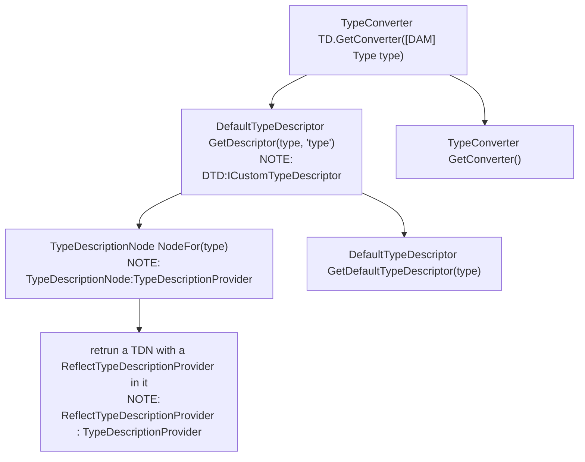

# TypeDescriptor

TypeDescriptor.GetCnverter

```mermaid
graph TD;
    A["TypeConverter TD.GetConverter([DAM] Type type)"]-->B;
    B["DefaultTypeDescriptor GetDescriptor(type, 'type')
    NOTE: DTD:ICustomTypeDescriptor"]-->C;
    C["TypeDescriptionNode NodeFor(type)
    NOTE: TypeDescriptionNode:TypeDescriptionProvider"]-->D["retrun a TDN with a ReflectTypeDescriptionProvider in it
    NOTE: ReflectTypeDescriptionProvider : TypeDescriptionProvider"];
    B-->E["DefaultTypeDescriptor GetDefaultTypeDescriptor(type)"]
    A-->F["TypeConverter GetConverter()"]
```

End of the flowgraph
