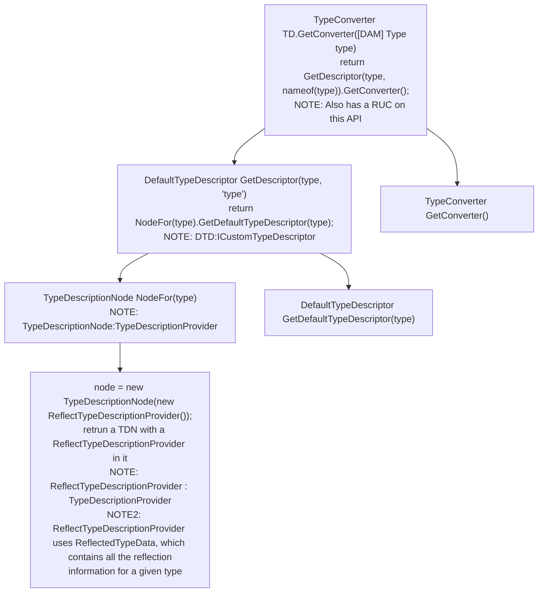

# TypeDescriptor

TypeDescriptor.GetCnverter

```mermaid
graph TD;
    A["TypeConverter TD.GetConverter([DAM] Type type)
      return GetDescriptor(type, nameof(type)).GetConverter();
    NOTE: Also has a RUC on this API"]-->B;
    B["DefaultTypeDescriptor GetDescriptor(type, 'type')
      return NodeFor(type).GetDefaultTypeDescriptor(type);
    NOTE: DTD:ICustomTypeDescriptor"]-->C;
    C["TypeDescriptionNode NodeFor(type)
    NOTE: TypeDescriptionNode:TypeDescriptionProvider"]-->D["node = new TypeDescriptionNode(new ReflectTypeDescriptionProvider());
    retrun a TDN with a ReflectTypeDescriptionProvider in it
    NOTE: ReflectTypeDescriptionProvider : TypeDescriptionProvider
    NOTE2: ReflectTypeDescriptionProvider uses ReflectedTypeData, which contains all the reflection
    information for a given type"];
    B-->E["DefaultTypeDescriptor GetDefaultTypeDescriptor(type)"]
    A-->F["TypeConverter GetConverter()"]
```

